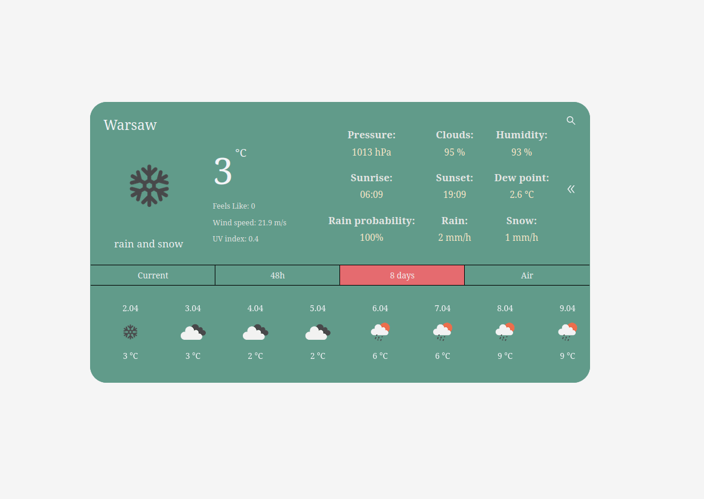

# Weather App

Check the weather conditions anywhere in the world.

Available weather data:
- Current
- 48h - hourly forecast
- 8 days - daily forecast
- Air Pollution - current status

## Install

    $ git clone https://github.com/sobczyk-m/Weather-App.git
    $ cd Weather-App
    $ npm install

## Running the project

This project uses an external API to retrieve weather data. To make it work properly, you need to obtain an API key
from [openweathermap.org](https://openweathermap.org/), then create the .env file inside the app root path with the
following variable:

    $ VITE_OWM_API_KEY=${YOUR API KEY}

Run:

    $  npm run dev

## Preview:

## Try it here:

https://sobczyk-m-weather-app.netlify.app/
